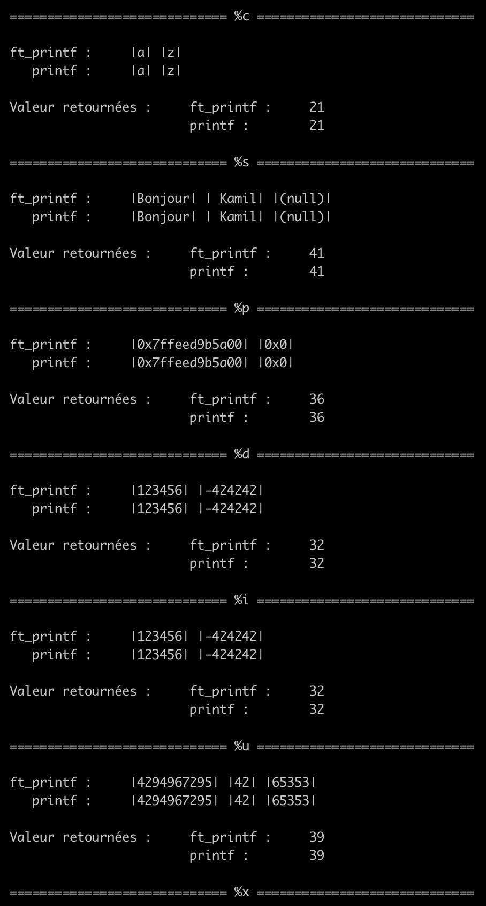
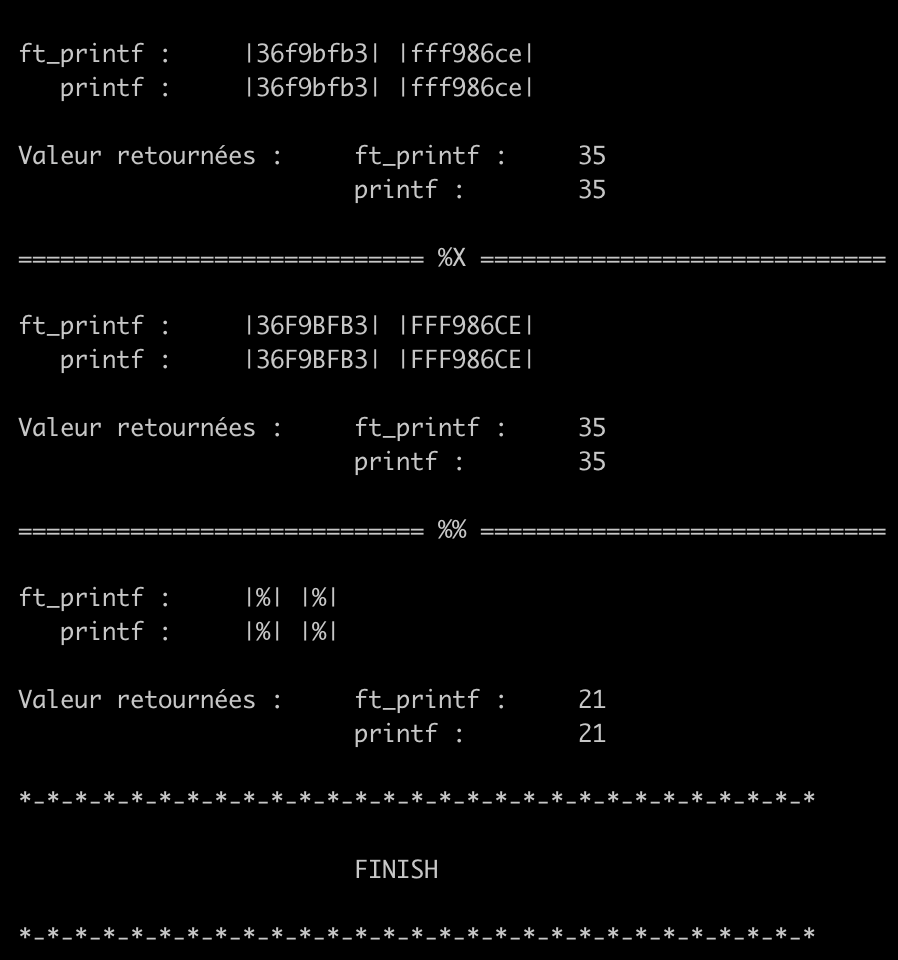

# ft_printf 📝

Recreate the printf function in C.

## Score 🎯
------
Not graded yet

## Installation 🧩
------
Use GitHub [repository](https://github.com/KamilBczk/ft_printf-42) to install.

```bash
$ > git clone https://github.com/KamilBczk/ft_printf-42.git
$ > cd ft_printf-42
```

## Usage 🔧
------
Test the code with [printfTester](https://github.com/Tripouille/printftester)
```bash
$ > cd printfTester
$ > make -m
```

Manual test with main file
```bash
$ > make
$ > gcc main/main.c libftprintf.a
```
## Some images

Make with colors & informations

The result of tests

The main file




## License 📜
Thanks for @Tripouille > [printfTester](https://github.com/Tripouille/printftester)